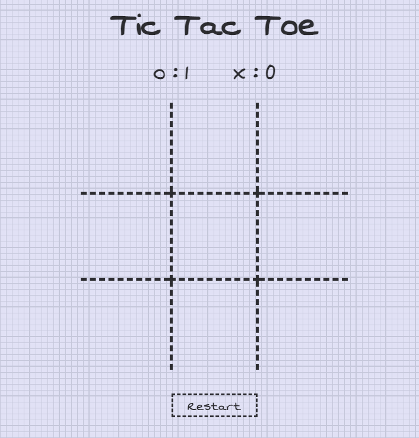

# GA-SEI Project Zero Tic Tac Toe

This is a version of the classic game Tic-Tac-Toe built as part of the General Assembly Software Engineering Immersive curriculum.

You can play it [here](https://griffy92.github.io/tic-tac-toe/).

## Built With

- HTML
- CSS
- Javascript
- JQuery

## Features

- Can be played by two human players
- Detects when a game is win or tied
- Can be restarted by clicking 'restart' button
- Displays 'Win' or 'Draw' message

## How to play

The game is played on a 3x3 grid with each player taking turns marking a square with their symbol. The first player to get three of their symbols in a row (horizontally, vertically or diagnoally) wins the game.

## Roadmap

- AI-mode

## Acknowledgements

Special thanks to the GA instructors (Joel, CJ, Mark & Tina) for their support.

The game also uses [Animate.css](https://animate.style/)

